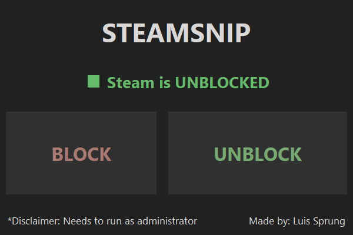

# SteamSnip

#### SteamSnip is a lightweight tool that blocks or unblocks Steam from the firewall with a single click. 
### *It can also be used to bypass Steam Family Sharing restrictions.

## Features

- One-click blocking and unblocking of Steam via Windows Firewall
- Real-time status indicator
- Responsive interface
- Minimalist dark theme

## UI Preview

## Requirements

- Windows 10/11

## Getting Started

- Download the latest release
- Make sure the SteamSnip is in administrator mode when opening
- Snip Away!
